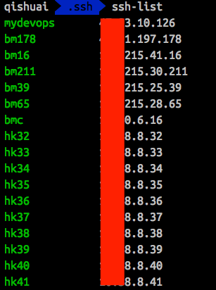

## ssh-list return ssh-server alias list accompanied by ip

## Usage:

Configure profile to support this feature[recommended]. Add following to your profile:
```apple js
alias sshlist="sed -n 'p' /Users/\$USER/.ssh/config | awk '{if(\$1==\"HOST\") printf(\"\033[0;32m%-12s\",\$2)}{if(\$1==\"HostName\")printf(\"%s\n\", \$2)}'"
```

If you have do above, omit following.

1. define ssh-server alias(~/.ssh/config)

	```
	// like this
	HOST hk40
    IdentityFile ~/.ssh/id_rsa
    Port 22
    User cp
    HostName 167.38.8.40

	HOST hk41
    IdentityFile ~/.ssh/id_rsa
    Port 22
    User cp
    HostName 145.38.8.41
    
    ...
	```
	
2. compile source code

	```
	go build -o ssh-list main.go
	```
	
3. move to the binary file to your PATH

	```
	mv ssh-list /usr/local/bin
	
	// recommended
	mv ssh-list $GOBIN
	```	
	
	> get help `ssh-list -h`

## LIke this:



